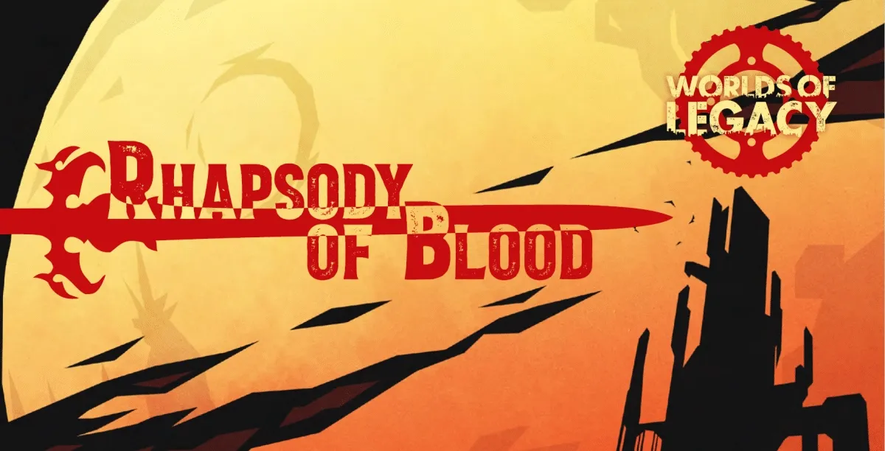
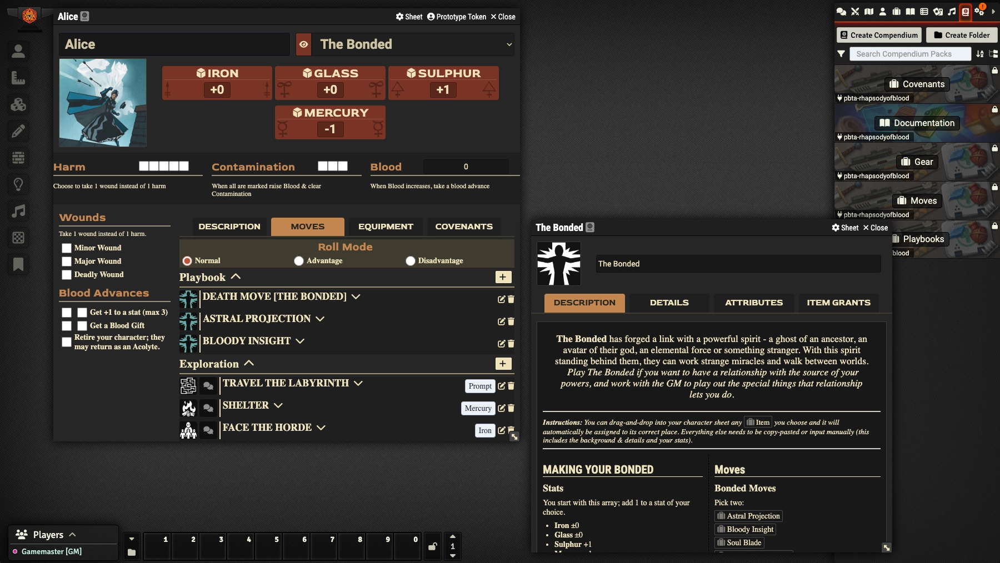
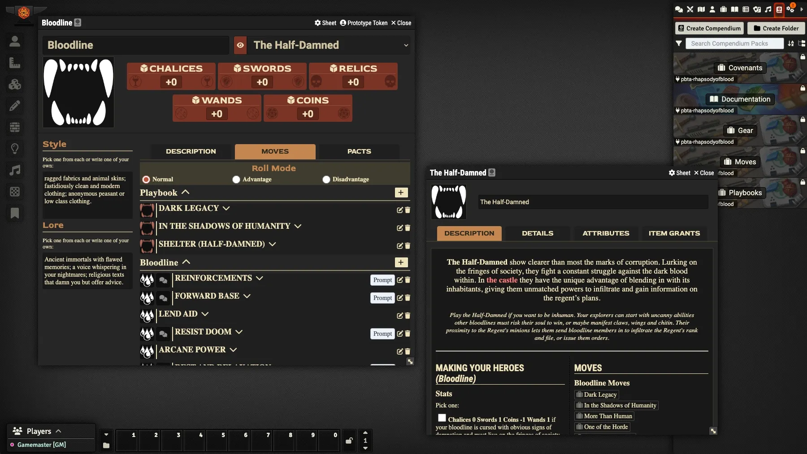

# A Rhapsody of Blood package for the Foundry PbtA System

    
    
     
     
    
    

     
     
     
    

   	

An unofficial ["Rhapsody of Blood RPG"](https://ufopress.co.uk/product/rhapsody/) (a [Worlds of Legacy](https://ufopress.co.uk/worlds-of-legacy/) game from [UFO Press](https://ufopress.co.uk/)) providing custom sheets and compendiums for Foundry VTT, to be used with the [Powered by the Apocalypse](https://github.com/asacolips-projects/pbta) Foundry system package (by Asacolips).

If you’ve enjoyed my work and find value in what I create, please consider supporting me with a small donation on [Ko-fi](https://ko-fi.com/G2G3I91JQ). I truly love what I do, and your support helps me dedicate time and resources to ongoing development. Every contribution, no matter the size, makes a difference and allows me to continue doing what I’m passionate about. Thank you for considering—it means the world to me.

## Dependencies

The following Foundry VTT game system must be installed to use this module: [Powered by the Apocalypse](https://github.com/asacolips-projects/pbta).

## Features

- Designed sheets for Explorers & Bloodlines.
- Compendiums with:
    - Playbooks for Explorers, Founders, & Bloodlines
    - All the Moves to play the game
    - Gear & Armor
    - Actor templates for the Explorer, Founder, & Bloodline sheets ready to use
- PbtA Playbook automation
- Tabs for Covenants and Pacts

This software includes ideas, text and images from ["Rhapsody of Blood RPG"](https://ufopress.co.uk/product/rhapsody/) by [Minerva McJanda (Formerly known as Jay Iles)](https://ufopress.co.uk/about-us/).

Icons from game-icons.net are released under a Creative Commons Attribution 3.0 Unported license. https://creativecommons.org/licenses/by/3.0/
